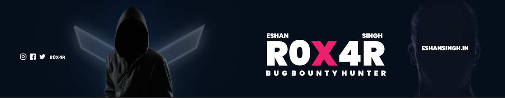

<h1>Hi, I'm Eshan Singh </h1>

---

I am a Cyber Security Enthusiast and a Hacker with an Ethical mindset.
I'm having experience in ``Web-app security``, ``Mobile app security``, ``API security``, ``Vulnerability Assessment & Penetration Testing``. I am experienced with tools like ``burpsuite``, ``acunetix``, ``Nmap``, ``Pentest tools``, and of course with ``Kali Linux`` & some GitHub open source tools like ``Amass``, ``Aquatone``, etc many more for finding the vulnerabilities in the web application and mobile application. I have also made some scripts for the infosec community which helps beginners to find low-hanging bugs. I have frequently found ``account takeover``, ``injections``, ``privilege escalation``, etc vulnerabilities on many programs. 

I have secured over 60+ companies which includes some big tech companies like Google, Nokia, TripAdvisor, SAP Concour, Dell Technologies, Seagate, Mastercard, Netgear, and many more. Also I have 2 years experience in WordPress development and graphics designing I have made 12+ websites using wordpress and also edit and make graphics as my side hobby.

### Key Skills

 

### Social Media

### Stats

&nbsp; 

