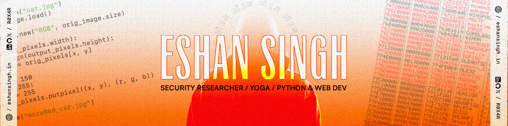

  

Cybersecurity Enthusiast • Ethical Hacking • Development • Open Source

## About Me

I’m a cybersecurity enthusiast and developer with experience in penetration testing, vulnerability assessment, bug bounty hunting, and secure application development.

My interests mainly revolve around web security, API security, automation, and low-level systems. I enjoy building tools, researching vulnerabilities, and learning how systems work internally.

Alongside cybersecurity, I also work with modern web technologies including Next.js, React, Tailwind CSS, and backend development. Recently, I’ve been focusing more on Go and exploring Rust for systems programming and performance-focused applications.

I also have experience in graphic design and UI work using Photoshop, Illustrator, and After Effects.

## Tools & Technologies

- Python
- Bash
- JavaScript / TypeScript
- Go
- Rust (Learning)
- React / Next.js
- Tailwind CSS
- Linux
- Docker

## Connect With Me

